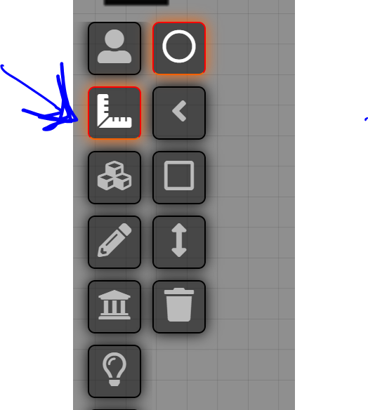
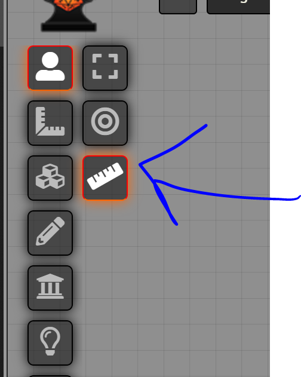
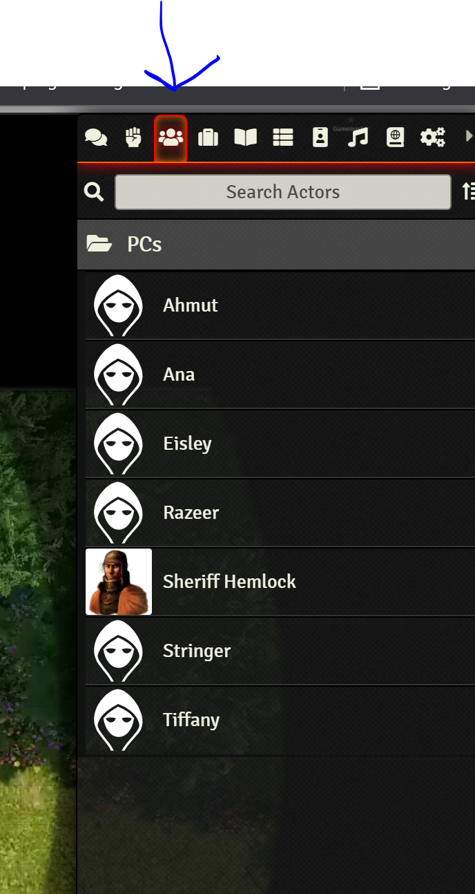

# Player Guide

## Rise of the Runelords and Foundry VTT

This is a quick start guide for using foundry

### Links

- [Game Link](https://dewseph-rise-of-the-runelords.forge-vtt.com)

> All your passwords are blank.

### How to Sign up

- [Click this Invite Link](https://forge-vtt.com/invite/dewseph-rise-of-the-runelords/d79d914b-5edc-4282-b90a-ac52629b66f9) and make an account. Its free.
- Click Access Game
- Select your name (there is no password)

## Guides

> Disclaimer: I haven't watch all the videos (yet) so they may suck

- [Cool video series](https://www.encounterlibrary.com/guides/players-guide-user-interface-in-foundry-vtt/)
- [`reads like VHS instructions` player guide](https://foundryvtt.com/article/player-orientation/)

### Quick How-tos

#### Roll dice

Use the chat command. There is a `3d Dice` plugin that you can customize for your own dice

``` bash
/roll 1d10
```

#### Ping on the map

- Click and hold on the map
- I believe this is also configurable via the `Module Settings`

#### Cones, Area of Effects

- 

#### Measure distance



#### Change your token/avatar

- You should be see your Player in the actors tabs 
- Click on your name to see your character sheet and click on your
- Click the image in the upper left corner, this should bring up the upload image dialog
- TO change your token, in the upper right of the character sheet  you will see a link for the `prototype token`. Click that and change things there.  

#### Character Sheet

Feel free to use the built in character, I have heard its nice, but I have played with it much. Guides and stuff are online

### Tips and tricks

- If its lagging, then change the framerate in the settings to low. This is Pathfinder, not Call of Duty
- In the Settings, especially the module settings I recommend looking at settings for the flowing modules and playing around with them
  - Dice so Nice
  - Pings
  - Zoom/Pan options (I switched mine to `touchpad` and never looked back)
- If you come across modules that look cool, we can install them
- THe Marcos are JavaScript based. :shrug: sounds fun
